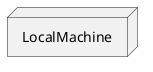
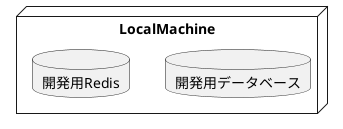

ローカル開発環境
=====

# 動作環境

ローカル環境では全ての資材を自身のPC内で完結させます。

資材を動作させるためDB, Redisを実行させます。

# 開発用データベース

Postgressを利用します。
同じuserと同じパスワードでデータベース名を揃えて作成します。
更新サービス業務毎にスキーマを分けます。
新たなサービスアプリケーションを作成する場合にはスキーマ名称を考えます。
DBのmigration(移行)ツールのflywayの都合でデータベースのバージョンを選択します。

## 開発用Redis

セッション保持とcacheとして使用します。
同じuserと同じパスワードでデータベース番号を揃えて作成します。

